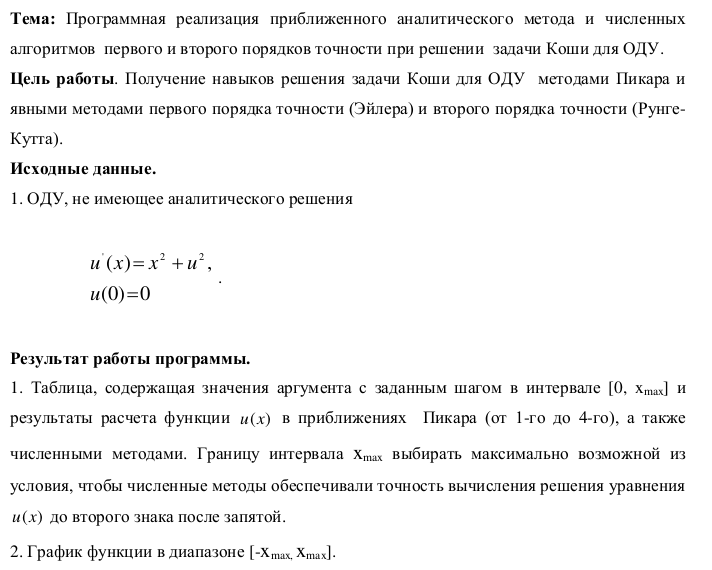
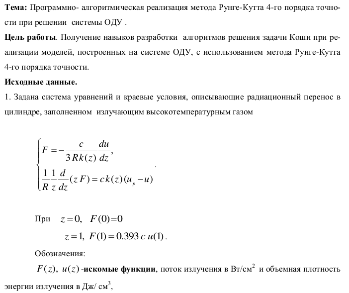
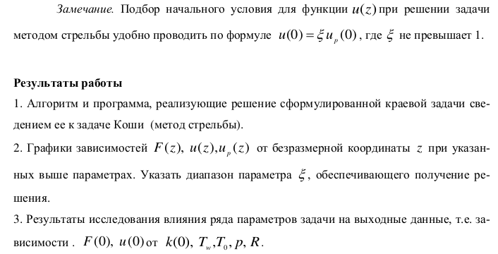
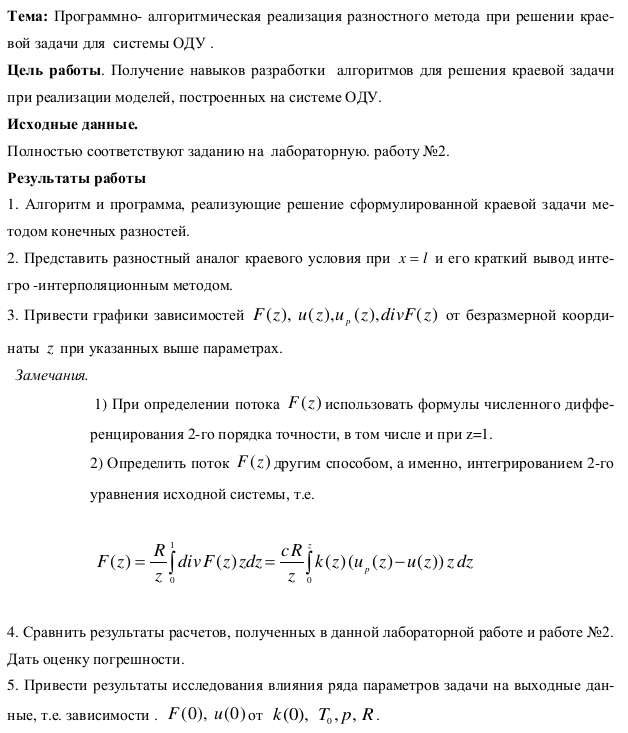
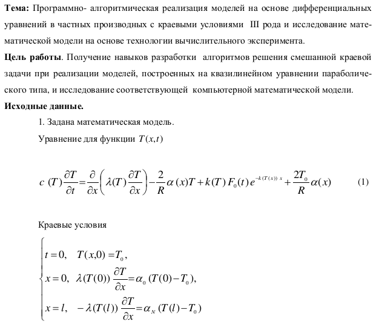
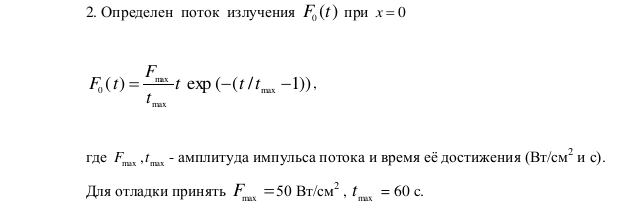
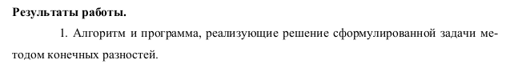

# Course: 3

## Semester: 6

### Subject: Modeling

Done all labs

Some labs were made together with [Alena](https://github.com/alena-zayts)

## 1. Решение задачи Коши для ОДУ методами приближенно-аналитическими (Пикара) и явными методами первого порядка точности (Эйлера) и второго порядка точности (Рунге-Кутта).

## 2. Метод Рунге-Кутта 4-го порядка точности при решении системы ОДУ

## 3. Решение краевой задачи методом конечных разностей.

## 4. Решение дифференциальных уравнений в частных производных с краевыми условиями III рода (краевая задача)

